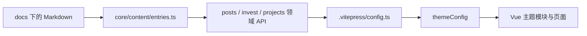

# 当前架构

## 目标与边界

本站是由 VitePress 构建并部署到 GitHub Pages 的静态知识站。文章、投资记录和项目介绍都是 Markdown 文件；构建阶段负责扫描和组织内容，浏览器端只消费已经注入主题的数据，不直接读取文件系统。

## 内容数据流

`docs/.vitepress/theme/core/content/entries.ts` 是扫描 Markdown、解析 frontmatter、归一化日期、获取更新时间和生成路由的唯一实现。`modules/post`、`modules/invest` 和 `modules/projects` 只配置各自目录及过滤条件，再由 `docs/.vitepress/config.ts` 将结果注入 `themeConfig`。

## 主题边界

- `theme/core/`：跨内容域的数据类型、扫描、日期和路径规则。
- `theme/modules/`：按业务域组织组件、视图、常量和领域适配器；模块不自行扫描文件系统。
- `theme/shared/`：布局、通用效果和跨模块 composable。
- `theme/index.ts`：组合默认主题、注册 Pinia 以及可在 Markdown 中使用的全局组件。
- `theme/styles/tokens.css`：运行时设计 token；规范值与使用原则由根目录 `DESIGN.md` 定义。
- `theme/styles/base.css`：页面基础样式和跨页面内容模式。
- `theme/styles/vitepress.css`：对 VitePress 默认主题类名和变量的定向覆盖。
- `theme/index.ts`：按 token、基础样式、VitePress 覆盖的顺序加载全局 CSS。

## 运行时与外部服务

内容索引在 Node 构建阶段生成。浏览器端负责页面交互、主题切换、评论数加载和 giscus 评论渲染。评论配置位于 `theme/modules/comment/`，敏感标识通过 `VITE_GISCUS_*` 环境变量或 GitHub Secrets 注入。

## 部署

`.github/workflows/deploy-pages.yml` 在 `master` 更新后使用 pnpm 构建，将 `docs/.vitepress/dist` 发布到 `gh-pages`。构建产物不是源码，不在仓库主分支维护。

## 不变量

- 内容文件继续位于 `docs/posts/`、`docs/invest/` 和 `docs/projects/`。
- 内容扫描、时间与路由规则只在 `core/content/entries.ts` 实现一次。
- 页面组件通过 `themeConfig` 或模块封装读取内容，不直接访问文件系统。
- 视觉规则以 `DESIGN.md` 为规范源，CSS 变量是其运行时映射。
- 行为变化由 `openspec/` 管理；本文件只描述已经落地的当前结构。
