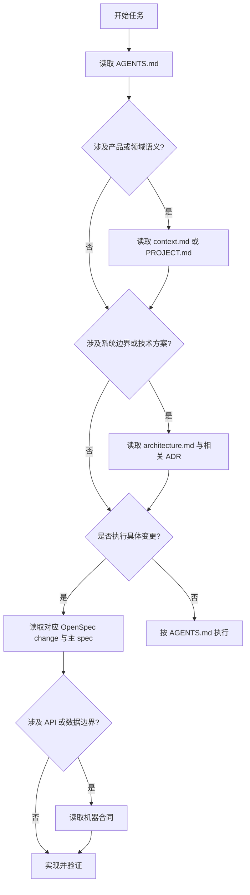

# Code Agent 项目的上下文文件设计指南

与 Code Agent 协作时，最常见的问题不是“上下文文件太少”，而是同一事实被复制到多份文件：项目介绍写进 README，技术栈又写进 `CONTEXT.md`，执行规则散落在提示词里，任务进度继续追加到 `MEMORY.md`。文件越多，Agent 读到冲突和过期内容的概率越高。

一个健壮的项目不需要维护一套庞大的“AI 文档系统”。更实用的结构只有四层：

1. `AGENTS.md`：操作协议与上下文入口；
2. `docs/context.md` 或 `PROJECT.md`：项目背景；
3. `docs/architecture.md`：系统设计；
4. `openspec/`：当前行为规格与变更执行。

这四层分别回答“怎样工作”“为什么做”“系统怎样组成”和“这次改变什么”。其他文件只应在真实需求出现时增加。

## 1. 设计原则：一条事实只有一个所有者

上下文文件的价值不是让 Agent 一次性读完项目，而是帮助它找到当前任务所需的事实源。因此，设计这些文件时应遵循四个原则：

- **单一所有者**：一条事实只在一个地方维护，其他文件只引用它。
- **渐进式披露**：先加载操作规则，再根据任务按需加载业务、架构和规格。
- **可验证事实优先**：代码、测试、配置和 schema 比自然语言摘要更可信。
- **复杂度触发**：没有真实内容时不创建空文件，也不为未来可能需要的场景预先搭建文档体系。

文件名本身并不能保证公共语义。例如，社区中确实存在大量 `CONTEXT.md`，但它没有统一的 schema、位置或自动加载规则。团队可以使用这个名字，却必须自行定义它负责什么以及 Agent 何时读取。

## 2. `AGENTS.md`：操作协议与导航入口

[`AGENTS.md`](https://agents.md/) 是目前最接近跨工具共识的 Agent 指令文件。它应当告诉 Agent 在这个仓库中如何工作，而不是重新介绍整个项目。

适合写入：

- 项目常用的安装、构建、测试和 lint 命令；
- 修改完成后必须执行的验证；
- 不能直接编辑的生成文件及其源文件位置；
- 安全、数据和迁移方面的约束；
- 指向项目背景、架构、OpenSpec 和机器合同的索引；
- 无法从代码和配置中直接发现的重要约定。

不适合写入：

- 完整产品介绍；
- 大段架构说明；
- 当前任务进度；
- 可以从 `package.json`、构建脚本或 CI 直接得到的版本清单；
- README 和其他文档的复制内容。

一个精简的示例：

```md
# Repository instructions

## Commands

- Install: `pnpm install`
- Build: `pnpm docs:build`
- Test: `pnpm test`

## Required validation

- Documentation changes must pass `pnpm docs:build`.
- Do not edit generated files under `docs/public/generated/`.

## Context routing

- Product or domain changes: read `docs/context.md`.
- Architectural changes: read `docs/architecture.md` and relevant ADRs.
- Feature work: read the relevant `openspec/changes/<change-id>/`.
```

大型 monorepo 可以在子目录增加嵌套的 `AGENTS.md`，但子文件只应描述相对根文件的差异，避免复制父级规则。

### 参考定义与实现

| 类型 | 可直接读取的资料 | 用途 |
|---|---|---|
| 开放格式主页 | [AGENTS.md](https://agents.md/) | 定义文件定位、推荐内容、嵌套作用域，并提供最小示例 |
| 格式示例 | [AGENTS.md 示例入口](https://agents.md/#examples) | 查看真实仓库如何组织 setup、test、style 等规则 |
| 标准实现 | [OpenAI Codex 的 AGENTS.md](https://github.com/openai/codex/blob/main/AGENTS.md) | 参考大型 Rust monorepo 的构建、测试和子目录约束 |
| 标准实现 | [Apache Airflow 的 AGENTS.md](https://github.com/apache/airflow/blob/main/AGENTS.md) | 参考大型 Python 项目的开发命令、测试和贡献约束 |

需要注意：`AGENTS.md` 是开放约定，不是带固定字段和版本化语法的正式标准。它规定了可发现的文件名与作用域，但 Markdown 章节仍由项目自行设计。

## 3. `docs/context.md` 或 `PROJECT.md`：项目背景

项目背景负责解释业务世界，而不是代码世界。它的读者需要理解项目为何存在、服务谁、解决什么问题，以及哪些事情明确不属于项目范围。

推荐内容：

```md
# Project context

## Purpose
## Users
## Core scenarios
## Domain terms
## Scope
## Non-goals
## Business rules
## External constraints
## Sources of truth
```

`docs/context.md` 与 `PROJECT.md` 没有本质差异，应当二选一：

- 希望强调产品目的和项目边界时，可以使用 `PROJECT.md`；
- 希望作为业务、领域和组织背景的综合入口时，可以使用 `docs/context.md`。

不要同时维护两份内容相近的文件。技术栈、组件关系和部署拓扑属于架构层；单次需求和验收条件属于 OpenSpec；临时任务状态则不应进入长期项目背景。

对于目标直接、领域知识很少的小工具，这一层可以完全省略。

### 参考定义与实现

`context.md` 和 `PROJECT.md` **没有官方 schema 或跨工具标准实现**。这里标准化的是信息职责，而不是文件名。可参考以下开放资料选择内容：

| 类型 | 可直接读取的资料 | 可借鉴内容 |
|---|---|---|
| 产品背景参考 | [Cline Memory Bank：projectBrief 与 productContext](https://github.com/cline/prompts/blob/main/.clinerules/memory-bank.md) | 项目范围、目标、用户问题和产品行为；这是 Cline 的社区实现，不是通用标准 |
| 架构背景模板 | [arc42：Introduction and Goals](https://docs.arc42.org/section-1/) | 目标、质量目标、利益相关者 |
| 系统边界模板 | [arc42：Context and Scope](https://docs.arc42.org/section-3/) | 业务上下文、外部系统和接口边界 |
| 本文建议模板 | 本节的 `Project context` 示例 | 适合作为团队自定义 `context.md`/`PROJECT.md` 的最小起点 |

因为没有公共标准，必须在 `AGENTS.md` 中显式写出文件路径、读取触发条件和维护边界，不能假设 Agent 会自动发现它。

## 4. `docs/architecture.md`：系统设计

架构文档负责描述当前系统的稳定结构与约束，重点是代码目录本身无法清楚表达的信息：系统边界、组件职责、关键数据流、运行方式、部署关系和跨模块不变量。

可以从 [arc42](https://arc42.org/overview) 的架构文档维度中选择必要章节，并使用 [C4 Model](https://c4model.com/diagrams) 表达不同层级的系统视图：

```md
# Architecture

## Goals and quality attributes
## System context
## Components
## Data flow
## Runtime scenarios
## Deployment
## Cross-cutting constraints
## Invariants
## Risks and technical debt
## Related ADRs
```

这不是要求每个项目填写完整模板。一个只有少量文件、边界直观的项目不需要专门的架构文档；当多个服务、模块或部署环境之间的关系仅靠代码难以理解时，再创建它。

架构文档描述“现在是什么样”，重要决策的历史原因则交给 ADR。这样可以避免 `architecture.md` 逐渐变成不可维护的会议记录。

### 参考定义与实现

| 类型 | 可直接读取的资料 | 用途 |
|---|---|---|
| 架构模板定义 | [arc42 Template Overview](https://arc42.org/overview) | 了解目标、约束、上下文、构建块、运行时、部署、决策和风险等完整维度 |
| 官方模板 | [arc42 Downloads](https://arc42.org/download) | 下载 Markdown、GitHub Markdown、AsciiDoc 等可直接采用的模板，包含中文版本 |
| 视图标准参考 | [C4 Model Diagrams](https://c4model.com/diagrams) | 选择 System Context、Container、Component 等不同缩放层级 |
| 精简实现 | [arc42 Architecture Communication Canvas](https://canvas.arc42.org/downloads) | 对完整 arc42 过重时，使用 Markdown + Mermaid 的单页架构画布 |

`architecture.md` 同样没有唯一公共文件名。arc42 提供内容模板，C4 提供建模视图；本文建议把它们裁剪后落入一个可被 Agent 索引的 Markdown 入口。

## 5. `openspec/`：行为真相与变更执行

OpenSpec 不只是一个 `tasks.md` 生成器。它同时管理系统当前行为和单次变化：

```text
openspec/
├── specs/                    # 系统当前行为
└── changes/
    └── <change-id>/
        ├── proposal.md       # 为什么改、范围是什么
        ├── specs/            # 行为变化及验收场景
        ├── design.md         # 技术方案与取舍
        └── tasks.md          # 执行步骤与验证
```

根据 [OpenSpec 核心模型](https://openspec.dev/docs/overview)，默认流程是：

```text
proposal → specs → design → tasks → implement → archive
   why       what      how      steps        merge into truth
```

- `openspec/specs/` 描述系统当前真实行为；
- `openspec/changes/` 描述准备进行的变化；
- proposal 负责意图和范围；
- delta specs 负责可观察的需求与场景；
- design 负责技术方案；
- tasks 负责任务顺序和完成状态；
- archive 将完成的变化合并回主 specs。

因此，采用 OpenSpec 后通常不再需要自己维护全局 `TASKS.md`、`PLAN.md` 或 `STATUS.md`。更完整的安装与命令说明可参考站内的[《OpenSpec 使用指南》](/posts/OpenSpec%20使用指南)。

### 参考定义与实现

| 类型 | 可直接读取的资料 | 用途 |
|---|---|---|
| 核心定义 | [OpenSpec Core Concepts](https://openspec.dev/docs/overview) | 定义 specs、changes、delta specs、artifacts 和 archive |
| 规格写法 | [Writing Good Specs](https://openspec.dev/docs/writing-specs) | 直接读取 requirement、GIVEN/WHEN/THEN scenario 的编写规范 |
| 评审标准 | [Reviewing a Change](https://openspec.dev/docs/reviewing-changes) | 按 proposal → specs → design → tasks 顺序审查变更 |
| 标准实现 | [Examples & Recipes](https://openspec.dev/docs/examples) | 查看完整 change 目录、纯重构和逐步生成等实例 |
| 机器接口 | [OpenSpec CLI Reference](https://openspec.dev/docs/reference/cli) | Agent 可用 `status`、`instructions`、`templates`、`validate` 获取结构化状态和校验结果 |
| 本文的实际工作包 | [`document-agent-context-model`](https://github.com/helloahao096/helloahao096.github.io/tree/main/openspec/changes/document-agent-context-model) | 本文从 proposal、spec、design、tasks 到验证的标准实现；合并到主分支后可直接读取 |

OpenSpec 是这四层中结构最明确的一层：默认 schema 定义 artifact 依赖，CLI 可以验证 change；但它仍允许项目自定义 schema，因此 Agent 应优先读取项目自己的 `openspec/config.yaml` 和 CLI 输出。

## 6. 四层如何渐进式加载

Agent 不应该在每次任务开始时读取全部文档。合理的读取路径是：



这就是渐进式披露：`AGENTS.md` 是路由器，不是百科全书；其他文件只在任务触发对应问题时加载。

## 7. 按需扩展，而不是第五个必选层

### 7.1 ADR：记录重大且持久的决策

[Architecture Decision Record](https://adr.github.io/) 适合记录存在多个合理选项、会长期影响系统，而且后来者很可能追问“为什么”的决策。

```text
docs/adr/
├── 0001-use-postgresql.md
└── 0002-adopt-event-driven-integration.md
```

普通实现选择留在 OpenSpec `design.md` 或代码中即可。只有需要跨越当前变更长期保留的决策，才值得晋升为 ADR。

可直接采用的资料：

- [ADR 社区定义](https://adr.github.io/)：解释 ADR、decision log 和常见工具；
- [ADR Templates](https://adr.github.io/adr-templates/)：比较 Nygard、MADR 等模板；
- [MADR 4.0](https://adr.github.io/madr/)：维护活跃、结构明确的 Markdown 模板；
- [MADR minimal template](https://github.com/adr/madr/blob/4.0.0/template/adr-template-minimal.md)：可以直接复制的最小实现。

ADR 是广泛工程惯例，不存在唯一强制 schema。若项目选择 MADR，应在 `AGENTS.md` 或 `architecture.md` 中记录所采用的模板版本和目录。

### 7.2 机器合同：接口和数据边界

当系统存在稳定接口时，自然语言说明不应成为最终合同：

- HTTP API 使用 OpenAPI；
- 事件接口使用 AsyncAPI；
- JSON 数据使用 JSON Schema；
- RPC 或二进制消息使用 Protocol Buffers。

这些文件可由工具验证、生成客户端或参与契约测试，是比 Markdown 摘要更强的事实源。它们属于具体系统边界，不属于所有项目都要创建的通用 Agent 上下文层。

| 合同类型 | 官方规范 | 标准实现入口 |
|---|---|---|
| HTTP API | [OpenAPI Specification](https://spec.openapis.org/oas/latest.html) | `openapi.yaml`/`openapi.json`；文件名是惯例，规范不强制路径 |
| 事件/消息 API | [AsyncAPI Specification](https://www.asyncapi.com/docs/reference/specification/latest) | `asyncapi.yaml`/`asyncapi.json` |
| JSON 数据 | [JSON Schema 2020-12](https://json-schema.org/draft/2020-12) | `*.schema.json`，并在文档中声明 `$schema` |
| RPC/消息 | [Protocol Buffers Language Guide](https://protobuf.dev/programming-guides/proto3/) | `*.proto` |

Agent 应直接读取这些合同文件，而不是依赖 `architecture.md` 对字段、消息或响应结构的二次转述。

### 7.3 `DESIGN.md`：只用于视觉设计系统

`DESIGN.md` 可以承载颜色、字体、组件、间距和设计 token，适合具有明确视觉系统的产品。但它不等同于软件架构文档，也不是所有代码项目的必选文件。没有独立设计系统时，相关约束放在现有 UI 规范或组件代码中即可。

Google Labs 已发布一个开放的 [`DESIGN.md` draft specification](https://github.com/google-labs-code/design.md)，其标准实现由 YAML frontmatter 的设计 token 与 Markdown 设计语义组成。可直接读取：

- [完整格式规范](https://github.com/google-labs-code/design.md/blob/main/docs/spec.md)；
- [官方示例](https://github.com/google-labs-code/design.md#the-format)；
- [设计理念](https://github.com/google-labs-code/design.md/blob/main/PHILOSOPHY.md)；
- CLI 校验：`npx @google/design.md lint DESIGN.md`；
- 向 Agent 输出规范：`npx @google/design.md spec`。

该格式目前仍标记为 `alpha`。因此可以在视觉密集型项目中试用并固定版本，但不应把它描述成已经成熟的跨行业标准。

## 8. 不建议长期沉淀的文件

以下名称在不同工具和团队中都能见到，但不应默认成为仓库长期事实：

- `MEMORY.md`
- `STATUS.md`
- `PROGRESS.md`
- `HANDOFF.md`
- `LEARNINGS.md`

它们通常与 Git、issue、PR、OpenSpec tasks 或代码事实重复，而且更新频率远高于项目背景和架构，最容易失效。需要跨会话交接时，可以使用当前对话、issue/PR 或任务系统；真正持久的发现应晋升到测试、`AGENTS.md`、架构文档或 ADR，而不是永久累积在记忆文件中。

## 9. 推荐目录与采用路径

完整但仍然克制的目录如下：

```text
AGENTS.md
README.md

docs/
├── context.md                # 有稳定业务/领域背景时
├── architecture.md           # 系统边界不再显而易见时
└── adr/                      # 有重大持久决策时

openspec/
├── specs/
└── changes/

api/
└── openapi.yaml              # 存在 HTTP API 时

schemas/
└── *.schema.json             # 存在共享 JSON 合同时
```

按复杂度逐步采用：

| 项目情况 | 建议配置 |
|---|---|
| 小型、边界直观 | `AGENTS.md + openspec/` |
| 存在专门业务或领域语义 | 增加 `docs/context.md` 或 `PROJECT.md` |
| 多模块、多服务或复杂部署 | 增加 `docs/architecture.md` |
| 出现需要长期解释的决策 | 增加相关 ADR |
| 存在稳定 API 或数据交换 | 增加相应机器合同 |

## 10. 维护检查表

每次增加或修改上下文时，可以检查：

- 这条信息是否已经能从代码、测试、配置或 schema 得到？
- 它是否已经在另一份文档中拥有明确的事实来源？
- 它属于操作、项目背景、架构，还是单次变化？
- Agent 是否真的需要在执行相关任务时读取它？
- 文件是否写明了更新触发条件，而不是只记录创建时的快照？
- 删除这段内容后，Agent 是否仍能通过索引找到权威事实？

如果最后一个问题的答案是“能”，通常应该删除重复内容。

## 11. Agent 可直接读取的资料索引

如果希望后续 Agent 不经过搜索就能定位规范，可以在根 `AGENTS.md` 中维护一份短索引：

```md
## Context and standards

- Project/domain context: `docs/context.md`
- Current architecture: `docs/architecture.md`
- Architecture decisions: `docs/adr/` (MADR 4.0)
- Current behavior specs: `openspec/specs/`
- Active change: `openspec/changes/<change-id>/`
- OpenSpec rules: `openspec/config.yaml`
- HTTP contract: `api/openapi.yaml`
- Visual design system: `DESIGN.md` (Google Labs alpha spec)

External definitions:
- AGENTS.md: https://agents.md/
- OpenSpec: https://openspec.dev/docs/overview
- arc42: https://arc42.org/overview
- C4: https://c4model.com/diagrams
- MADR: https://adr.github.io/madr/
- OpenAPI: https://spec.openapis.org/oas/latest.html
```

索引只负责指路，不复制这些规范的正文。这样，人和 Agent 都能先读取仓库内的实际文件，需要解释格式时再访问对应的一手资料。

## 总结

与 Code Agent 协作的项目不需要维护十几种上下文文件。一个足够健壮的基线是：

- 用 `AGENTS.md` 定义操作协议并提供索引；
- 用 `docs/context.md` 或 `PROJECT.md` 保存稳定的产品和领域背景；
- 用 `docs/architecture.md` 描述非显而易见的系统结构；
- 用 OpenSpec 管理当前行为、单次变化、技术方案和任务执行。

ADR、机器合同和视觉 `DESIGN.md` 由真实复杂度触发。其余状态和记忆文件不默认沉淀。上下文体系越小、事实所有权越清楚，Agent 才越容易在正确的时间读取正确的信息。
