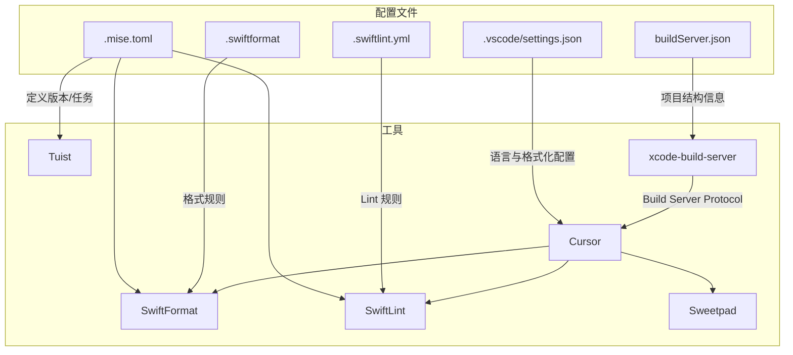
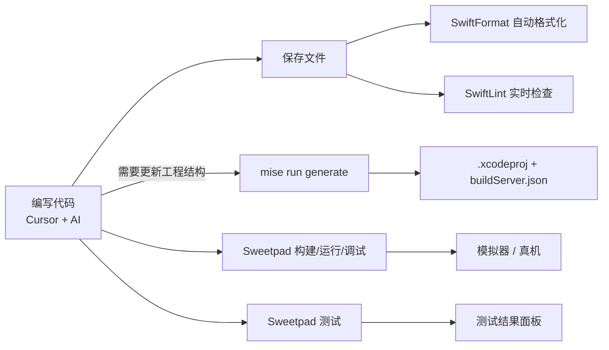

> 本文聚焦 Cursor + Sweetpad + Tuist + Mise + Xcodes + xcode-build-server + SwiftFormat + SwiftLint 的协同使用，构建一套健壮、可维护的 iOS/SwiftUI 开发环境。

> **前置要求与环境说明**
>
> 在开始构建之前，请确认以下两点关键环境配置，以避免后续出现构建错误：
>
> 1. **Xcode 仍是必要依赖**：本方案旨在替代 Xcode 的**编辑器**功能，但底层仍依赖 Xcode 提供的编译器 (clang/swiftc)、SDK、模拟器及调试器 (LLDB)。请确保本机已正确安装 Xcode。
> 2. **项目路径必须位于 APFS 卷**：Tuist 与 SourceKit-LSP 强依赖 POSIX 文件系统特性。请务必将项目创建在 **Mac 本机磁盘**（APFS 格式）下。外置硬盘（exFAT/FAT32）或网络挂载卷会导致路径解析失败（如 `invalid relative path`）及索引失效。

### 适用场景与阅读顺序

- **你适合读这篇文档，如果**：已经有一定 iOS / SwiftUI 开发经验，希望在 macOS 上用 Cursor + Tuist + Mise 取代传统纯 Xcode 工作流。
- **本文不覆盖**：CI/CD、复杂模块化设计等高级主题，只专注「本机开发环境 + 工具链协同」。
- **推荐阅读路径**：
  - 第一次搭建时：按顺序阅读「一 → 二 → 三」，先用第二节的「最小可用示例」跑通，再回到第三节按步骤细化配置。
  - 已有经验想查速记：直接看第二节「安装与初始化」，把它当成命令速查表使用。

## 一、工具链概览与职责

```mermaid
graph TD
    subgraph Environment [系统环境]
        Xcodes[Xcodes] -->|管理| Xcode[Xcode / CLT]
        Xcode -.->|提供| Swift[Swift Toolchain]
    end

    subgraph VersionControl [版本管理 (Mise)]
        Mise[Mise] -->|锁定版本| TuistCLI[Tuist]
        Mise -->|锁定版本| SFormat[SwiftFormat]
        Mise -->|锁定版本| SLint[SwiftLint]
    end

    subgraph Project [项目管理]
        Config[Project.swift] -->|输入| TuistCLI
        TuistCLI -->|生成| Xcodeproj[.xcodeproj / .xcworkspace]
    end

    subgraph Editor [开发体验 (Cursor)]
        Cursor -->|LSP 支持| SourceKit[SourceKit-LSP]
        SourceKit -->|依赖| Swift
        XBS[xcode-build-server] -->|Build Server Protocol| SourceKit
        XBS -->|读取| Xcodeproj
        Cursor -->|保存自动执行| SFormat
        Cursor -->|实时检查| SLint
        Cursor -->|扩展| Sweetpad[Sweetpad]
        Sweetpad -->|构建/运行/调试| Xcode
    end
```

### 工具职责与配合

| 工具 | 主要职责 | 与其他工具的配合 | 官方文档 |
|------|---------|----------------|---------|
| **[Cursor](https://www.cursor.com/)** | 代码编辑、AI 辅助 | 使用 Xcode 自带的 Swift；通过 xcode-build-server 获得完整智能补全；集成 SwiftFormat/SwiftLint；通过 Sweetpad 构建运行 | [Swift 配置指南](https://docs.cursor.com/guides/languages/swift) |
| **[Sweetpad](https://github.com/sweetpad-dev/sweetpad)** | 构建/运行/调试/测试 | 在 Cursor 中直接构建、运行、调试和测试，无需打开 Xcode IDE | [文档](https://sweetpad.hyzyla.dev/) · [VS Code 市场](https://marketplace.visualstudio.com/items?itemName=sweetpad.sweetpad) |
| **[xcode-build-server](https://github.com/SolaWing/xcode-build-server)** | LSP 桥接 | 实现 Build Server Protocol，让 SourceKit-LSP 理解 Xcode 项目结构，提供完整的代码补全与类型推断 | [GitHub](https://github.com/SolaWing/xcode-build-server) |
| **[Tuist](https://tuist.dev/)** | 项目结构生成 | 使用 Mise 管理的 Tuist 版本；生成 Xcode 项目供 Cursor 使用 | [安装指南](https://docs.tuist.dev/en/guides/install-tuist) · [CLI 参考](https://docs.tuist.dev/en/cli/init) |
| **[Mise](https://mise.jdx.dev/)** | 工具版本统一管理 | 管理 Tuist、SwiftFormat、SwiftLint 版本（Swift 由 Xcode 提供） | [快速开始](https://mise.jdx.dev/getting-started.html) · [CLI 参考](https://mise.jdx.dev/cli/) |
| **[Xcodes](https://github.com/XcodesOrg/xcodes)** | Xcode 版本管理 | 下载/切换 Xcode，为编译和 SourceKit 提供工具链 | [GitHub](https://github.com/XcodesOrg/xcodes) · [GUI 版本](https://github.com/XcodesOrg/XcodesApp) |
| **[SwiftFormat](https://github.com/nicklockwood/SwiftFormat)** | 代码格式化 | 通过 Mise 管理版本；集成到 Cursor 和 Git Hooks | [规则文档](https://github.com/nicklockwood/SwiftFormat/blob/main/Rules.md) · [Releases](https://github.com/nicklockwood/SwiftFormat/releases) |
| **[SwiftLint](https://github.com/realm/SwiftLint)** | 代码质量检查 | 通过 Mise 管理版本；集成到 Cursor 和 Git Hooks | [规则参考](https://realm.github.io/SwiftLint/rule-directory.html) · [Releases](https://github.com/realm/SwiftLint/releases) |

### 为什么是这些工具？——选型对比与依据

每个环节的工具选择都有替代方案，以下是选型理由：

#### 编辑器：Cursor

| 选项 | 优势 | 劣势 | 结论 |
|------|------|------|------|
| **Cursor** ✅ | AI 深度集成（RAG 索引全项目）、VS Code 生态兼容、Sweetpad 支持完善 | SourceKit-LSP 稳定性不如 Xcode 原生、偶有 AI 补全与编译器建议冲突 | **当前最优解** |
| VS Code | 免费、扩展生态成熟 | AI 辅助需额外配置插件，不如 Cursor 原生深度 | Cursor 的上游，功能子集 |

#### 项目管理：Tuist

| 选项 | 优势 | 劣势 | 结论 |
|------|------|------|------|
| **Tuist** ✅ | Swift DSL 类型安全、模块化支持完善、内置依赖管理与构建缓存、Mise 官方推荐 | 学习曲线中等、4.x 起部分高级功能（缓存等）关联 Tuist Server 付费服务 | **健壮性最优** |
| XcodeGen | YAML 配置简单、上手快 | 无构建缓存、无模块化支持、大型项目管理能力弱、构建稳定性不如 Tuist | 适合 MVP/原型，长期项目建议 Tuist |
| 纯 SwiftPM | Apple 官方、零额外依赖 | 项目结构管理能力有限、大型模块化项目体验差 | 适合纯 Library 开发，App 项目不够用 |

#### 工具版本管理：Mise

| 选项 | 优势 | 劣势 | 结论 |
|------|------|------|------|
| **Mise** ✅ | 统一管理所有工具版本、自动切换目录即切换环境、Rust 编写性能好、Tuist 4 官方推荐 | 需要在 shell 中激活 | **当前最优解** |
| Mint | Swift 专用包管理器 | 只能管理 Swift CLI 工具、无法管理 Tuist 等非 Swift 工具、功能范围窄 | 被 Mise 完全覆盖 |
| Homebrew | 通用、大家都会用 | 全局安装无法按项目锁定版本、团队一致性无法保证 | 不适合项目级版本管理 |

#### Xcode 版本管理：Xcodes

| 选项 | 优势 | 劣势 | 结论 |
|------|------|------|------|
| **Xcodes** ✅ | aria2 并行下载（3-5x 速度）、支持 Beta、CLI + GUI 双模式、4k+ stars 社区活跃 | 无 | **当前最优解，无有力竞品** |
| xcenv | 可切换 Xcode 版本 | 社区极小（249 stars）、功能单一、维护不活跃 | 不推荐 |

#### 代码格式化：SwiftFormat (nicklockwood)

| 选项 | 优势 | 劣势 | 结论 |
|------|------|------|------|
| **SwiftFormat** ✅ | 规则丰富且可高度自定义、社区成熟（7k+ stars）、与 Cursor 集成完善 | 非 Apple 官方 | **社区事实标准** |
| swift-format (Apple) | Apple 官方内置、基于 SwiftSyntax 精确解析 | 规则较少定制性弱、主要为 Xcode 设计、Cursor 集成不如 SwiftFormat 成熟 | 适合纯 Xcode 用户 |

#### 代码检查：SwiftLint

| 选项 | 优势 | 劣势 | 结论 |
|------|------|------|------|
| **SwiftLint** ✅ | iOS 社区事实标准（18k+ stars）、规则覆盖广、与 Cursor/Sweetpad 集成成熟 | 无 | **当前最优解，无有力竞品** |
| Periphery | 专注检测未使用代码 | 只做死代码检测，不替代 SwiftLint | 作为 SwiftLint 的补充，非替代品 |

#### LSP 桥接：xcode-build-server

| 选项 | 优势 | 劣势 | 结论 |
|------|------|------|------|
| **xcode-build-server** ✅ | 实现 Build Server Protocol、让 SourceKit-LSP 获得完整项目上下文 | 需要在 `tuist generate` 后额外执行配置命令 | **在 Cursor 中开发的必备组件** |
| 不使用 | 零配置 | 自动补全残缺、类型推断频繁失败、第三方依赖无法识别 | 体验无法接受 |

## 二、安装与初始化

### 环境初始化

```bash
# 1) 安装 Xcodes（用于管理多个 Xcode 版本）
#    官方: https://github.com/XcodesOrg/xcodes
brew install xcodesorg/made/xcodes
xcodes install 16.2
xcodes select 16.2

# 2) 安装 Mise 并在 zsh 中启用
#    官方: https://mise.jdx.dev/getting-started.html
brew install mise
echo 'eval "$(mise activate zsh)"' >> ~/.zshrc  # 一次性添加到 ~/.zshrc
source ~/.zshrc  # 或重新打开一个终端

# 3) 安装 xcode-build-server（SourceKit-LSP 的桥接层，Cursor 智能补全的关键）
#    官方: https://github.com/SolaWing/xcode-build-server
brew install xcode-build-server

# 4) 验证基础工具链（Swift 由 Xcode 提供）
xcodebuild -version
xcrun swift --version

# 5) 配置 Cursor（详细见后文）
# 安装扩展（点击链接可直接跳转到扩展市场）：
# - Swift Language Support: https://marketplace.visualstudio.com/items?itemName=swiftlang.swift-vscode
# - Sweetpad: https://marketplace.visualstudio.com/items?itemName=sweetpad.sweetpad
# - SwiftFormat: https://marketplace.visualstudio.com/items?itemName=vknabel.vscode-swiftformat
# 并根据下文创建 .vscode/settings.json
```

### 项目初始化（最小可用示例）

> 本小节给出一屏内能跑通的「TL;DR」命令，详细解释与扩展配置见第三节「完整初始化实战」。

```bash
# 1) 创建项目目录
mkdir -p MyApp && cd MyApp

# 2) 配置 .mise.toml（与第三节示例保持一致）
cat > .mise.toml << 'EOF_TOML'
[tools]
tuist = "latest"
swiftformat = "latest"
swiftlint = "latest"

[env]
XCODE_VERSION = "16.2"

[tasks.generate]
description = "生成 Xcode 项目并配置 LSP"
run = """
tuist generate
xcode-build-server config -project *.xcodeproj -scheme MyApp
"""
EOF_TOML

# 3) 安装并激活当前项目需要的工具
mise install

# 4) 初始化并生成项目结构（交互式引导，按提示选择即可）
tuist init
mise run generate

# 5) 使用 Cursor 打开当前目录
cursor .
```

## 三、完整初始化实战

本节将演示如何从零开始，使用这套工具链初始化一个 SwiftUI 项目。


### 1. 准备工作

在继续之前，请先完成第二节「安装与初始化」中的环境准备（包括 Xcodes、Mise 和 xcode-build-server 的安装与激活）。  
如果你已经有一套可用的 Xcode 与 Swift 开发环境，可以直接从本节的「步骤演示」开始，对照命令逐步落地项目配置。

### 2. 步骤演示

#### 第一步：创建项目目录与环境配置

```bash
# 创建目录
mkdir MyApp && cd MyApp

# 初始化 Mise 配置
# 指定工具版本，确保团队一致性
cat > .mise.toml << 'EOF_TOML'
[tools]
tuist = "latest"
swiftformat = "latest"
swiftlint = "latest"

[env]
XCODE_VERSION = "16.2"

[tasks.generate]
description = "生成 Xcode 项目并配置 LSP"
run = """
tuist generate
xcode-build-server config -project *.xcodeproj -scheme MyApp
"""
EOF_TOML

# 安装并使用 .mise.toml 中声明的工具版本
mise install
```

!!! tip "关于版本锁定策略"
    示例中使用 `latest` 是为了方便快速上手。在团队协作项目中，建议首次 `mise install` 后通过 `mise ls` 查看实际安装的版本号，然后将 `latest` 替换为具体版本（如 `tuist = "4.154.2"`），确保团队一致性。各工具的最新版本请查阅：[Tuist Releases](https://github.com/tuist/tuist/releases) · [SwiftFormat Releases](https://github.com/nicklockwood/SwiftFormat/releases) · [SwiftLint Releases](https://github.com/realm/SwiftLint/releases)。

#### 第二步：使用 Tuist 初始化项目结构

```bash
# 初始化 iOS 应用结构（交互式引导，按提示选择平台和模板）
tuist init

# 此时目录下会生成：
# - Project.swift (项目定义)
# - Tuist/ (配置目录)
# - Sources/ (源码)
# - Tests/ (测试)
```

!!! note "Tuist 4.x 的 init 行为"
    Tuist 4.x 的 `tuist init` 是交互式 CLI，会引导你选择项目类型和平台。旧版的 `tuist init --name MyApp` 语法已不再支持。详见 [tuist init 官方文档](https://docs.tuist.dev/en/cli/init)。

#### 第三步：添加代码质量配置

创建 `.swiftformat` 配置文件（示例偏向可读性与团队一致性，可按需调整，完整规则见 [SwiftFormat Rules](https://github.com/nicklockwood/SwiftFormat/blob/main/Rules.md)）：
```bash
cat > .swiftformat << 'EOF_FMT'
--indent 4
--maxwidth 120
--wraparguments before-first
--wrapcollections before-first
--disable blankLinesAtStartOfScope
--disable blankLinesAtEndOfScope
--enable isEmpty
--enable strongifiedSelf
EOF_FMT
```

上述配置的大致意图：
- **统一缩进与行宽**：通过 `--indent 4` 与 `--maxwidth 120` 在可读性和 SwiftUI DSL 书写之间做平衡。
- **控制换行风格**：`--wraparguments` / `--wrapcollections` 让多参数、多元素时更利于 diff 与阅读。
- **精简空行**：禁用 scope 起始/结束处多余空行，保持文件结构紧凑。
- **启用部分规则**：如 `sortedImports` 等有助于保持 import 顺序稳定，减少无意义 diff。

创建 `.swiftlint.yml` 配置文件（示例更关注实用性，避免对 SwiftUI DSL 过于苛刻，完整规则见 [SwiftLint Rule Directory](https://realm.github.io/SwiftLint/rule-directory.html)）：
```bash
cat > .swiftlint.yml << 'EOF_LINT'
disabled_rules:
  - trailing_whitespace
  - line_length

opt_in_rules:
  - empty_count
  - empty_string
  - first_where
  - sorted_first_last
  - vertical_parameter_alignment_on_call

excluded:
  - Pods
  - .build
  - DerivedData
  - .tuist
EOF_LINT
```

上述配置的大致意图：
- **放宽个别规则**：关闭 `line_length`、`trailing_whitespace`，避免对 SwiftUI 链式/DSL 风格产生过多噪音。
- **启用更 Swifty 的写法**：通过 `opt_in_rules` 鼓励使用 `first(where:)` 等更语义化的 API。
- **忽略构建产物目录**：`Pods` / `.build` / `DerivedData` / `.tuist` 等不参与 lint，减少误报与扫描时间。

你可以用以下命令单独验证格式化与 Lint 是否正常：

```bash
swiftformat .
swiftlint lint
```

#### 第四步：配置编辑器 (Cursor)

**安装扩展**：
1. [**Swift Language Support**](https://marketplace.visualstudio.com/items?itemName=swiftlang.swift-vscode)（`swiftlang.swift-vscode`）— Apple 官方 Swift 语言支持
2. [**Sweetpad**](https://marketplace.visualstudio.com/items?itemName=sweetpad.sweetpad) — 构建、运行、调试、测试
3. [**SwiftFormat**](https://marketplace.visualstudio.com/items?itemName=vknabel.vscode-swiftformat)（`vknabel.vscode-swiftformat`）— 保存时自动格式化

创建 `.vscode/settings.json` 以启用自动化支持：

```bash
mkdir -p .vscode
cat > .vscode/settings.json << 'EOF_JSON'
{
  "files.associations": {
    "*.swift": "swift",
    "Project.swift": "swift",
    ".mise.toml": "toml"
  },
  "editor.formatOnSave": true,
  "[swift]": {
    "editor.defaultFormatter": "vknabel.vscode-swiftformat"
  },
  "files.exclude": {
    "**/.build": true,
    "**/DerivedData": true,
    "**/.tuist": true
  },
  "swiftformat.path": "~/.local/share/mise/shims/swiftformat",
  "swiftlint.path": "~/.local/share/mise/shims/swiftlint",
  "swiftlint.enable": true,
  "swiftlint.runOnSave": true
}
EOF_JSON
```

这些设置的作用大致如下：
- **语言服务**：Swift Language Support 扩展会自动检测 Xcode 工具链路径并启动 SourceKit-LSP，通常无需手动指定 `swift.path`。
- **文件关联与排除**：`files.associations` 让 `Project.swift` 等文件有正确的语法高亮；`files.exclude` 避免 Cursor 对构建产物进行索引，提升性能。
- **集成 SwiftFormat / SwiftLint**：通过 mise 的 **shim 路径**引用工具，升级版本后无需修改此文件。shim 会自动指向 `.mise.toml` 中声明的当前版本。

为了更直观地理解这些配置文件与工具之间的关系，可以参考下图：



#### 第五步：生成项目并配置 LSP

```bash
# 生成 Xcode 项目文件并配置 xcode-build-server（通过 mise 统一入口）
mise run generate

# 使用 Cursor 打开当前目录
cursor .
```

`mise run generate` 会依次执行 `tuist generate`（生成 `.xcodeproj`）和 `xcode-build-server config`（生成 `buildServer.json`），后者让 SourceKit-LSP 获得完整的项目上下文。

!!! warning "每次 `tuist generate` 后都需要重新配置"
    当你修改了 `Project.swift` 并重新执行 `tuist generate` 后，需要同步刷新 `buildServer.json`。这就是为什么我们在 `.mise.toml` 的 `tasks.generate` 中把两个命令串联在一起——始终使用 `mise run generate` 即可。

### 3. 开始开发

现在，你已经拥有了一个配置完备的开发环境：
1. **Tuist** 管理了项目结构，随时可以通过 `mise run generate` 重新生成项目文件。
2. **Mise** 锁定了工具版本，确保团队成员环境一致。
3. **xcode-build-server** 桥接了项目结构与 SourceKit-LSP，提供完整的智能补全。
4. **Cursor** 配置好了 Swift 支持，保存文件时会自动执行 **SwiftFormat** 和 **SwiftLint**。
5. **Sweetpad** 让你可以在 Cursor 中直接构建、运行、调试和测试，无需打开 Xcode IDE。

#### 开发工作流



**编写代码**：

- 在 Cursor 中编辑 Swift 文件，享受完整的代码补全与跳转（由 xcode-build-server + SourceKit-LSP 提供）
- 保存时自动格式化（SwiftFormat）
- 实时代码检查（SwiftLint）

**构建与运行**（使用 Sweetpad）：

- 按 `Cmd+Shift+P` 打开命令面板
- 输入 `Sweetpad: Build` 构建项目
- 输入 `Sweetpad: Launch` 运行到模拟器
- 输入 `Sweetpad: Debug` 启动调试模式
- 或使用 Sweetpad 侧边栏的按钮进行操作

**测试**（使用 Sweetpad）：

- 按 `Cmd+Shift+P` → `Sweetpad: Test` 运行全部测试
- 也可以在测试文件中通过 CodeLens 按钮运行单个测试用例
- 测试结果会显示在 Cursor 的测试面板中

**预览效果**：

- 运行后会自动打开模拟器
- 可以在 Cursor 的调试面板查看日志
- 支持断点调试

#### 可选增强：InjectionIII 热重载

如果你频繁调整 SwiftUI 界面，每次修改后重新编译的等待时间（通常 10-30 秒）会显著拖慢节奏。[InjectionIII](https://github.com/johnno1962/InjectionIII) 可以在不重启 App 的情况下热更新 Swift 代码，特别适合 UI 调试阶段。

安装与配置：

1. 从 Mac App Store 安装 [InjectionIII](https://apps.apple.com/us/app/injectioniii/id1380446739?mt=12)（免费）
2. 在项目的 Debug 配置中添加 Other Linker Flags：`-Xlinker -interposable`
3. 在 App 启动代码中加载 injection bundle：

```swift
#if DEBUG
@_exported import HotReloading
#endif
```

!!! tip "InjectionIII 是锦上添花，非必需"
    热重载在 UI 密集调试时能节省大量时间，但它对代码有一定侵入性（需要添加 linker flag 和 import）。如果你的修改频率不高或更偏向逻辑开发，可以暂时不引入。

你可以直接开始修改 `Sources/ContentView.swift`，享受流畅的开发体验。
